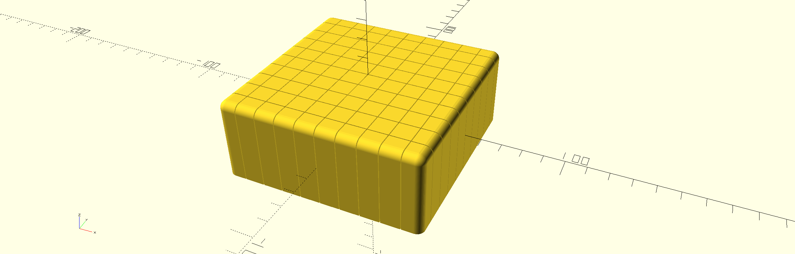
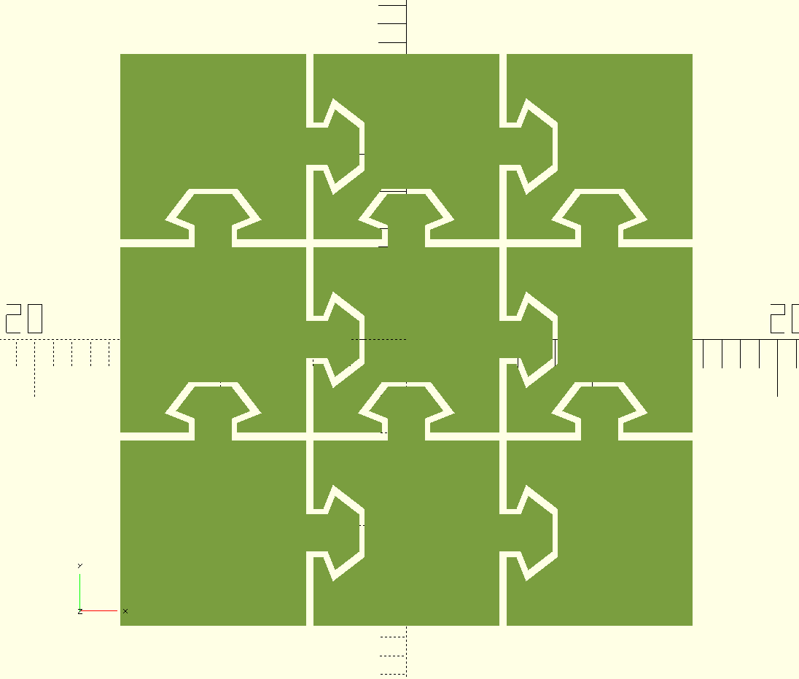
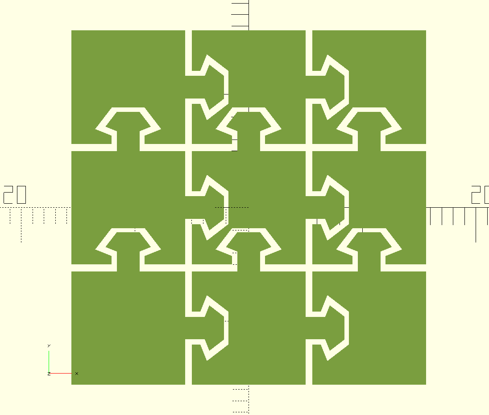

# Pixel Cube
I created this parameterized version of the pixelcube inspired by this original: https://www.printables.com/model/861264-fidget-pixel-cube

Here is a screenshot of a 10x10 cube:

Among the things that you can parameterize is:
* size of each column (can also have different width and depth)
* the height of the whole thing
* the numbers of columns (even 1x1 is possible ;-))
* the clearance between the knobs and columns (default is 0.4 mm)

Here are two examples of the clearance, they are lateral cuts through the model:

| Clearance: 0.4 mm | Clearance: 0.6 mm |
|-------------------|-------------------|
|  |  |
