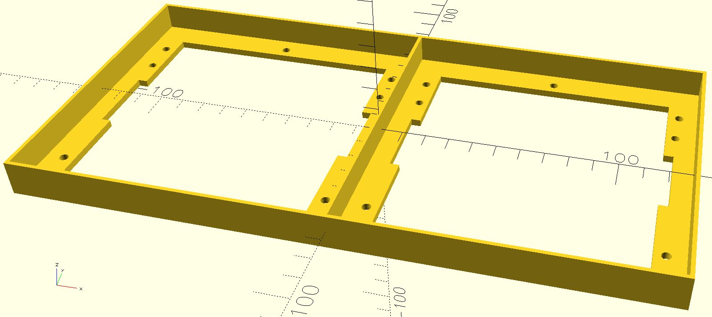

# RGB Matrix
There are various RGB LED matrices coming in different sizes and resolutions, e.g., a 64x64 pixel 2mm pitch matrix by Waveshare: [P2-64x64](https://www.waveshare.com/wiki/RGB-Matrix-P2-64x64).

Here is one OpenScad model for a frame of this particular matrix (including screw and pin holes):

